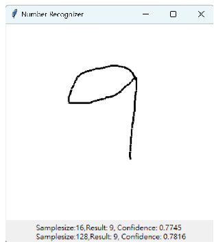
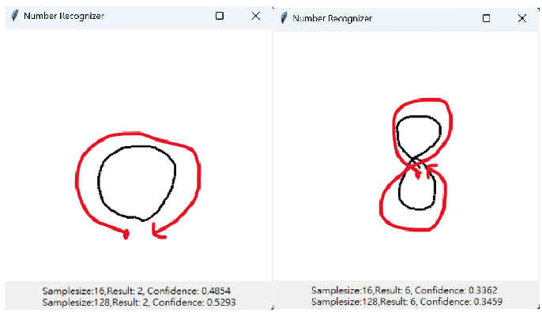
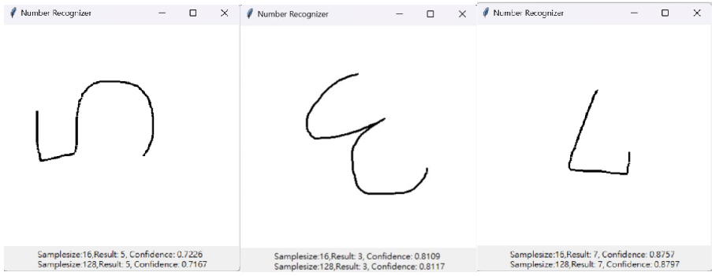

# 1-Unistroke-Recognize
## 介紹
以下範例我是使用 Python 來製作,並使用 tkinter 及 math 的函式庫。main.py 為主程式,同時去辨識不同 samplesize 的 recognizer 程式檔(dollar_16.py,dollar_128.py),且我辨識的演算法為黃金比例搜索法（Golden Section Search）。

## 辨識結果
圖一顯示不同手寫數字之辨識結果,可以看出 sample16 以及 sample128 皆可以正確辨識手寫數字,且大部份的信心程度皆高於 7 成,然而sample16 與 sample128 數值差異其實不大,我認為是因為數字的特徵相較簡單,因此在樣本數較少的情況也可以辨識出特徵。另一方面,在測試的過程中,會因為筆畫不合 template 的規範而造成辨識錯誤的問題,且信心程度都低於五成,如圖二。

   
   
  圖一、不同手寫數字之辨識結果

   
  圖二、辨識錯誤範例(0 和 8)

另外,我也嘗試寫出不同書寫角度的數字來測試,皆可以得出正確的結果,原因在於我在程式檔裡有將角度標準化的函數(function rotate_by),以致辨識不受角度影響。

   
  圖三、以不同角度寫出數字

